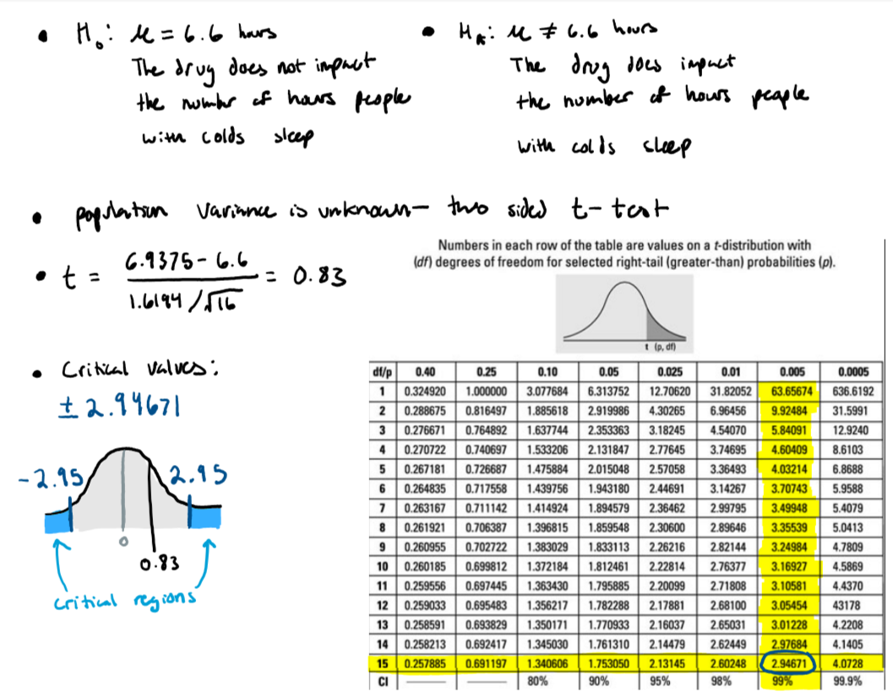

# Introduction  


***This week I learned how to build a prediction interval for the null model using the sample mean as the predicted value and using the standard error of prediction and a t-multiplier to determine the width of the interval.***  
  

```{r, message=FALSE, warning=FALSE}
# Load Packages
library(tidyverse)
library(dplyr)
library(ggpubr)
library(ISLR)
library(skimr)
```
  
# Confidence Intervals  
  
## Question A  
  
***We are 99% confident that the true mean weight reduction in the population of obese rock-hopper penguins at this zoo is between about 2.375 ounces and 19.625 ounces.***
```{r}
n <- 36 # sample size; number of penguins
mean <-  11 # Average sample weight loss in ounces
sd <- 19 # sample standard deviation of weight loss in ounces
alpha <- 0.01 # significance level, we have a 99% confidence level
moe <- abs( qt(p=(alpha/2), df=(n-1)) )*(sd/sqrt(n)) # margin of error
print(paste("99% confidence interval: (", mean-moe,", ", mean+moe, ").", sep=""))

```
  
## Question B  
  
***Our interval is entirely positive, we can be 99% confident that the true population weight loss is non-negative and non-zero. This means that we can be 99% confident that the weight loss program is working, we have sufficient evidence that the penguins are actually losing weight. If the average penguin weighs 3kg or ~(3\*35.274)=105.822 ounces I would recommend the diet. According to our confidence interval, with this diet it is plausible for the average penguin to lose an average of up to ~19% of their total weight, which seems like a practically significant amount of weight to me.***   
  
# Hypothesis Testing  
  
## Question C  
  
***With a significance level of 0.01, sample mean of ~6.94 hours, and a standard deviation of ~1.62 hours, our test statistic (t=0.83) does not fall in the rejection region (|t|>2.5) of our t-distribution. Therefore, we fail to reject the null hypothesis. We do not have evidence to suggest that the drug impacts the number of hours a person with a cold can sleep.***  
  
```{r}
sleep <- c(8.1,6.7,2.3,7.2,8.1,9.7,6.0,7.4,6.4,6.9,5.0,7.8,6.7,7.2,7.6,7.9)
print(paste("Sample mean:", mean(sleep)))
print(paste("Sample standard deviation:", sd(sleep)))
```
  
  
    
  
## Question D  
  
***Running a 1-sample t-test with the same data and same hypotheses as before, we see that our p-value is 0.4176 > $\alpha$=0.01. This value is not less than our significance level, so again we fail to reject the null hypothesis. We do not have evidence to suggest that the drug impacts the number of hours a person with a cold can sleep. This result agrees with our previous result from conducting the test by hand.***
  
```{r}
t.test(x=sleep, alternative="two.sided", mu=6.6, conf.level=0.99)
```

# Exploratory Data Analysis  
  
```{r}
dataset <- ISLR::Credit
?Credit
dim(dataset)
names(dataset)
length(unique(dataset$ID))
```

  
## Question E
  
***The Credit data set is a simulated data set with 12 variables and 400 rows. Each row in this data set is a customer, uniquely identified by the number in the ID column, with demographic and financial information on record. Other than ID, the rest of the variables are Income, Limit, Rating, Cards, Age, Education, Gender, Student, Married, Ethnicity, and Balance. The stated purpose of this data set is to "predict which customers will default on their credit card debt" (James et al. 2013).***  
  
## Question F  
  
***Only 40 people in this data set are students, the other 360 people in this data set are not students.***  

```{r}
table(dataset$Student)
```

## Question G  
  
***We'll look at the Income variable. First, I believe there might be a typo in the documentation for this. The documentation says income is in $10,000's, but I find that hard to believe because that would mean the average income for the people in this data set is very high at ~$450,000. This is even harder to believe when we look at the youngest people in this data set; the people in their 20s have, on average, six figure incomes. This is abnormally large for typical young adults. I think the documentation meant to say the incomes are listed in their thousands, not tens of thousands. However, this is simulated data so I suppose anything is possible. We will continue our interpretation under the assumption that the documentation says what it means to say.***

  
```{r, warnings=FALSE, message=FALSE}
# These summary statistics are strange, the lowest earners in this data set have 6 figure incomes
summary(dataset$Income)

# This shows the average incomes for the youngest people in the data set
dataset %>%
  group_by(Age) %>%
  summarise(avgIncome=mean(Income)) %>%
  arrange(Age) %>%
  head(10)


```
  
***The minimum and maximum incomes present are \$103,500 and \$1,866,300 respectively with a standard deviation of \$352,442 and an IQR of \$364,635. The mean income in this data set is \$450,000 and the median income is \$330,120. The median being lower than the mean implies that our data is positively skewed. To confirm this, we can look at the shape of our data's histogram and run a Shapiro-Wilk test for normality.***  
  
```{r}
# Changing the units of the income column to be in thousands,
# which is an easier unit to intuitively interpret
data.transformed <- dataset
data.transformed$Income <- data.transformed$Income*10

# Summary statistics
summary(data.transformed$Income)
sd(data.transformed$Income)
IQR(data.transformed$Income)
```
  
***When we test the null hypothesis $H_0:$ The Income data is normally distributed against the alternative hypothesis $H_A:$ The income data is not normally distributed, we get a W statistic of ~0.81 and a p-value of ~0<<$\alpha$=0.01. We can reject the null hypothesis at a 99% confidence level, there is strong evidence to suggest that the income data is not normally distributed. Looking at a histogram we can see this clearly and confirm our earlier suggestion that the data is positively skewed. There is a strong, positive skew to the distribution of the incomes in this data set. This skew makes sense, because most people make a moderate living while a few wealthier people make significantly more.***

```{r}

# Shapiro-Wilk Test for normality
shapiro.test(data.transformed$Income)

# Histogram
ggplot(data=data.transformed, aes(x=Income)) +
  geom_histogram(binwidth = 40, fill="#e35844", color="#c8341e") +
  theme_minimal() +
  xlab("Income (Thousands of Dollars)") +
  ylab("Frequency")


```

  
## Question H  
  
***If we restrict our view to only the incomes of students the distribution of the data doesn't change much. Each quartile is about the same as before and the mean student income is actually slightly higher than the overall income at \$472,900. This is surprising because students traditionally make less money than those established in their careers.  The student incomes are still skewed right, with much less data in the tail than in the overall distribution.***  
  
```{r, message=FALSE}
# Still using the transformed data, so our units is thousands of dollars
data.student <- 
  data.transformed %>%
  filter(Student=="Yes")

summary(data.student$Income)

ggplot(data=data.student, aes(x=Income)) +
  geom_histogram(fill="#e35844", color="#c8341e") +
  theme_minimal() +
  xlab("Student Incomes (Thousands of Dollars)") +
  ylab("Frequency")
  
```

  
  
  
  
  
  
  
  
  
  
  
  
  
  
  
  
  
  
  
  
  
  
  
  
  
